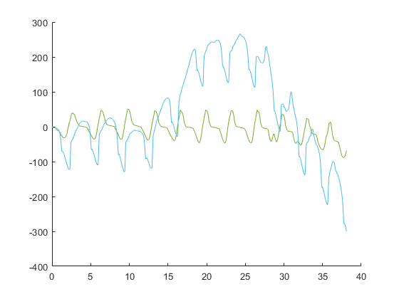


   
   
   

<!--
This HTML was auto-generated from MATLAB code.
To make changes, update the MATLAB code and republish this document.
-->


handle = load("initial_data\initial_handle.mat");
seat = load("initial_data\initial_seat.mat");
range = timerange('29-Nov-2022 16:50:17.905','29-Nov-2022 16:50:56.000','closed');
handle.Acceleration = handle.Acceleration(range, :);
handle.Orientation = handle.Orientation(range, :);
seat.Acceleration = seat.Acceleration(range, :);
seat.Orientation = seat.Orientation(range, :);
T1 = '16:50:17.905';
T2 = '16:50:39.019';
t1 = datevec(T1,'HH:MM:SS.FFF');
t2 = datevec(T2,'HH:MM:SS.FFF');
elapsed = etime(t2, t1);
slope = (264.677 - 2.4685)/elapsed;
x_int = 2.4685;

slope_handle = (-409.212 + 137.799)/(9.558 - 2.462);
handle.Velocity = timetable(handle.Acceleration.Timestamp, cumtrapz(handle.Acceleration.X), cumtrapz(handle.Acceleration.Y), cumtrapz(handle.Acceleration.Z), 'VariableNames',{'X','Y','Z'});

handle.Position = timetable(handle.Velocity.Time, cumtrapz(handle.Velocity.X), cumtrapz(handle.Velocity.Y), cumtrapz(handle.Velocity.Z), 'VariableNames',{'X','Y','Z'});

seat.Velocity = timetable(seat.Acceleration.Timestamp, cumtrapz(seat.Acceleration.X), cumtrapz(seat.Acceleration.Y), cumtrapz(seat.Acceleration.Z), 'VariableNames',{'X','Y','Z'});

seat.Position = timetable(seat.Velocity.Time, cumtrapz(seat.Velocity.X), cumtrapz(seat.Velocity.Y), cumtrapz(seat.Velocity.Z), 'VariableNames',{'X','Y','Z'});
velocity_sync = synchronize(handle.Velocity, seat.Velocity, 'union', 'linear');

normal_time = velocity_sync.Time.Second - velocity_sync.Time.Second(1,:);

normal_seat = velocity_sync.Y_2 - (slope*normal_time + x_int);

normal_handle = velocity_sync.X_1 - slope_handle*normal_time;

velo_normal = [normal_time normal_seat normal_handle];

figure(2);
hold on;
plot(velo_normal(:,1), velo_normal(:,2))
plot(velo_normal(:,1), velo_normal(:,3))
hold off;

% stackedplot(handle.Acceleration)
% stackedplot(handle.Velocity)
% stackedplot(handle.Position)
%
% stackedplot(seat.Acceleration)
% stackedplot(seat.Velocity)
% stackedplot(seat.Position)



 

 <a href="http://www.mathworks.com/products/matlab/" style="font-size: 0.7em">Published with MATLAB&reg; R2022a</a> 